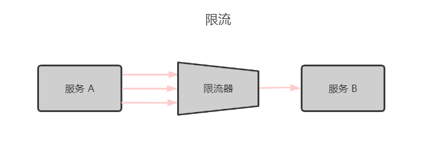
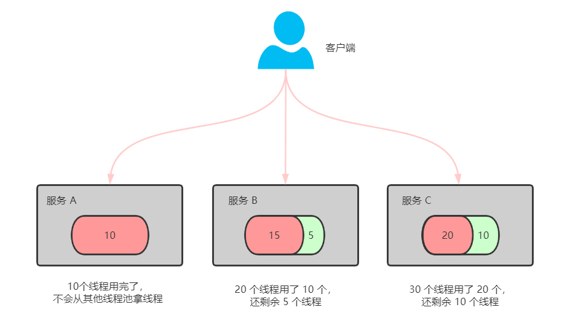
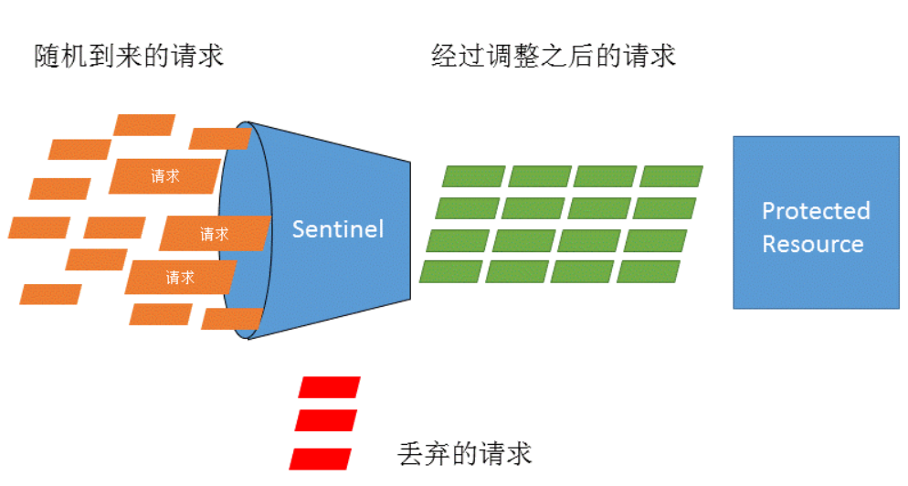

# 都12届双11了，还不懂流量防控？

临近双十一，从 2009 年第一届双十一开始，成交量只有 5000 万，到去年 2019 年，成交量达到了 2684 亿。今年迎来了第十二届双十一，想想都挺激动。

阿里人喜欢将双十一视为 Team Building（团队建设），广为流传的一句话：打仗是最好的团建，没有参加过双十一的叫同事，参加过双十一的叫战友。

本篇将会讲解微服务架构中经常被一线大厂使用的两款流量防控组件：Sentinel 和 Hystrix，以及对它们的横向对比。

## 一、熔断&降级&限流&隔离

面对高并发的流量，我们通常会使用四种方式（熔断&降级&限流&隔离）来防止瞬时大流量对系统的冲击。而今天要介绍的这两款流量防卫兵，是专门用在这方面的。下面我先给同学扫个小盲。

- **什么是熔断 ？** 

关键字：`断路保护`。比如 A 服务调用 B 服务，由于网络问题或 B 服务宕机了或 B 服务的处理时间长，导致请求的时间超长，如果在一定时间内多次出现这种情况，就可以直接将 B 断路了（A 不再请求B）。而调用 B 服务的请求直接返回降级数据，不必等待 B 服务的执行。因此 B 服务的问题，不会级联影响到 A 服务。

- **什么是降级 ？** 

关键字：`返回降级数据`。网站处于流量高峰期，服务器压力剧增，根据当前业务情况及流量，对一些服务和页面进行有策略的降级（停止服务，所有的调用直接返回降级数据）。以此缓解服务器资源的压力，保证核心业务的正常运行，保持了客户和大部分客户得到正确的响应。降级数据可以简单理解为快速返回了一个 false，前端页面告诉用户“服务器当前正忙，请稍后再试。”

- **什么是限流？** 

  

  对请求的流量进行控制， 只`放行部分请求`，使服务能够承担不超过自己能力的流量压力。

- **熔断和降级的相同点？**  

  - 熔断和限流都是为了保证集群大部分服务的可用性和可靠性。防止核心服务崩溃。
  - 给终端用户的感受就是某个功能不可用。

- **熔断和降级的不同点？** 

  - 熔断是被调用放出现了故障，主动触发的操作。
  - 降级是基于全局考虑，停止某些正常服务，释放资源。
  
- **什么是隔离？** 

  - 每个服务看作一个独立运行的系统，即使某一个系统有问题，也不会影响其他服务。

## 二、Hystrix 介绍

### Hystrix 是什么

Hystrix：高可用性保障的一个框架。由 Netflix 出品（Netflix可以理解为国内的爱奇艺等视频网站）。

### Hystrix 的历史

- 2011 年，其中的 API 团队为了提升系统的可用性和稳定性，发展出了 Hystrix 框架。

- 2012 年，Hystrix 区域比较成熟稳定。其他团队也开始使用 Hystrix。

- 2018 年 11 月，Hystrix在其 Github 主页宣布，不再开放新功能，推荐开发者使用其他仍然活跃的开源项目。但是 Hystrix 价值依旧很大，功能强大，国内很多一线互联网公司在使用。

### Hystrix 设计理念

- 阻止服务的雪崩效应。
- 快速失败和快速恢复。
- 优雅降级。
- 使用资源隔离技术，如 bulkhead（舱壁隔离技术）、swimlane（泳道技术）、circuit breaker（断路技术）。
- 近实时的监控、报警及运维操作。

### Hystrix 线程池隔离技术

使用线程池隔离，比如说有 3 个服务 A、B、C，每个服务的线程池分配 10，20，30个线程，当 A 服务线程池中的 10 个线程都拿出来使用后，如果调用服务 A 的请求量增加，还想再增加线程是不行的，因为 A 服务分配的线程已经用完了，不会拿其他的服务的线程，这样就不会影响其他服务了。Hystrix 默认使用线程池隔离模式。

#### 线程池隔离技术优点

- 依赖的服务都有隔离的线程池，即使自己的此案成池满了，也不会影响任何其他其他的服务调用。
- 线程池的健康状态会上报，可以近实时修改依赖服务的调用配置。
- 线程池具有异步特性，可以构建一层异步调用层。
- 具有超时检测的机制，尤其在服务间调用特别有用。

#### 线程池隔离技术缺点

- 线程池本身就会带来一些问题，比如线程切换，线程管理，无疑增加了 CPU 的开销。
- 如果线程池中的线程利用率很低，则无疑是一种浪费。

### Hystrix 信号量隔离技术

如下图所示：简单来说就是一个池子里面放着一定数量的信号量，服务 A 每次调用服务 B 之前，需要从池子里面申请信号量，申请到了，才能去调用 B 服务。

#### 线程池隔离和信号量的场景对比

- **线程池隔离技术** ，适合大部分场景，但需要设置服务的超时时间。
- **信号量隔离技术** ，适合内部比较复杂的业务，不涉及网络请求问题。

### Hystrix 断路器原理

## 三、Sentinel 介绍

###  Sentinel 是什么

Sentinel：面向分布式服务架构的流量控制组件，主要以流量为切入点，从限流、流量整形、熔断降级、系统负载保护、热点防护等多个维度来帮助开发者保障微服务的稳定性。

### Sentinel 的历史

- 2012 年，Sentinel 诞生，主要功能为入口流量控制。
- 2013-2017 年，Sentinel 在阿里巴巴集团内部迅速发展，成为基础技术模块，覆盖了所有的核心场景。Sentinel 也因此积累了大量的流量归整场景以及生产实践。
- 2018 年，Sentinel 开源，并持续演进。
- 2019 年，Sentinel 朝着多语言扩展的方向不断探索，推出 [C++ 原生版本](https://github.com/alibaba/sentinel-cpp)，同时针对 Service Mesh 场景也推出了 [Envoy 集群流量控制支持](https://github.com/alibaba/Sentinel/tree/master/sentinel-cluster/sentinel-cluster-server-envoy-rls)，以解决 Service Mesh 架构下多语言限流的问题。
- 2020 年，推出 [Sentinel Go 版本](https://github.com/alibaba/sentinel-golang)，继续朝着云原生方向演进。

### Sentinel 的特征

- 丰富的应用场景。支撑阿里的双十一核心场景，如秒杀、消息削峰填谷、集群流量控制、实时熔断下游不可用。
- 完备的实时监控。可以看到接入应用的单台机器秒级数据，以及集群的汇总情况。
- 广泛的开源生态。
- 

### Sentinel 的资源

Sentinel 中的资源是核心概念，可以是 Java 应用程序中的任何内容，可以是提供的服务，甚至是一段代码。

可以通过 Sentinel API 定义的代码，就是资源，能够被 Sentinel保护起来。可以如下几种方式来标识资源：

- 方法签名。
- URL。
- 服务名称等。

## Sentinel 的设计理念

Sentinel 作为一个流量控制器，可以根据需要把随机的请求调整成合适的形状，如下图所示：

有读者问我秒杀系统该怎么设计，下面我总结除了秒杀系统的关注的八大点：

- 服务单一职责、独立部署
- 库存预热、快速扣减
- 秒杀链接加密
- 动静分离
- 恶意请求拦截
- 流量错峰
- 限流&熔断&降级
- 队列削峰